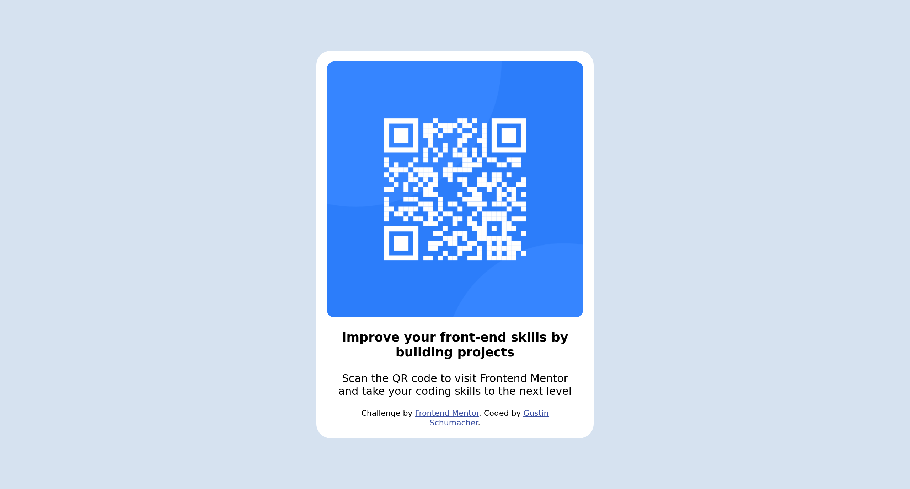

# Frontend Mentor - QR code component solution

This is a solution to the [QR code component challenge on Frontend Mentor](https://www.frontendmentor.io/challenges/qr-code-component-iux_sIO_H). Frontend Mentor challenges help you improve your coding skills by building realistic projects. 

## Table of contents

- [Overview](#overview)
  - [Screenshot](#screenshot)
  - [Links](#links)
- [My process](#my-process)
  - [Built with](#built-with)
 

## Overview

### Screenshot

### Links

- Solution URL: (https://github.com/GustinSchumacher/QRCode)

## My process

### Built with
VS Code
HTML/CSS

## Author

- Website - [Portfolio](https://gustinschumacher.github.io/)
- Twitter - [@gustinCodes](https://www.twitter.com/gustinCodes)
